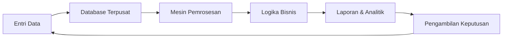
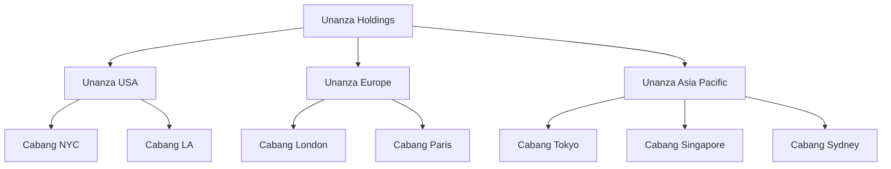
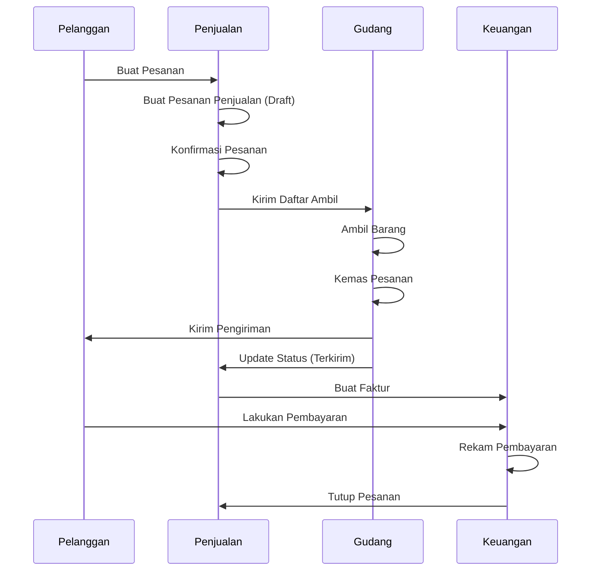
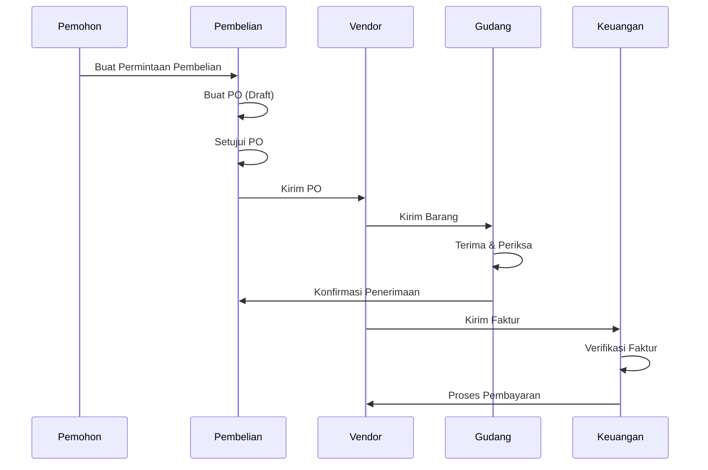
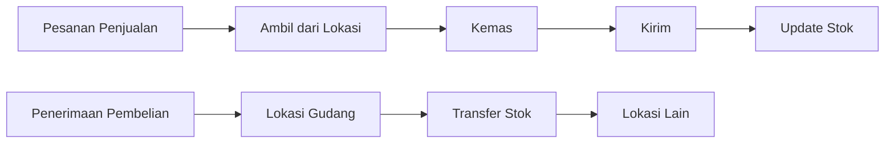
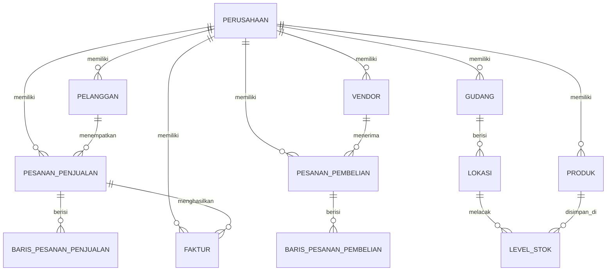

# Dokumentasi Sistem Enterprise Resource Planning (ERP)

## Daftar Isi

1. [Apa itu ERP?](#apa-itu-erp)
2. [Bagaimana Sistem ERP Bekerja](#bagaimana-sistem-erp-bekerja)
3. [Tinjauan Aplikasi](#tinjauan-aplikasi)
4. [Arsitektur Multi-Perusahaan](#arsitektur-multi-perusahaan)
5. [Analisis Modul Terperinci](#analisis-modul-terperinci)
6. [Alur Kerja Bisnis](#alur-kerja-bisnis)
7. [Model Data](#model-data)
8. [Arsitektur Teknis](#arsitektur-teknis)
9. [Panduan Pengguna](#panduan-pengguna)

---

## Apa itu ERP?

**Enterprise Resource Planning (ERP)** adalah jenis perangkat lunak yang digunakan organisasi untuk mengelola aktivitas bisnis sehari-hari seperti akuntansi, pengadaan, manajemen proyek, operasi rantai pasokan, dan manufaktur.

### Manfaat Utama Sistem ERP

- **Data Terpusat**: Satu sumber kebenaran untuk semua informasi bisnis
- **Otomasi Proses**: Mengurangi upaya manual dan kesalahan manusia
- **Visibilitas Real-time**: Akses instan ke metrik bisnis dan KPI
- **Kolaborasi Lebih Baik**: Departemen bekerja dari data yang sama
- **Kepatuhan Regulasi**: Kontrol dan jejak audit bawaan
- **Skalabilitas**: Berkembang sesuai kebutuhan bisnis Anda

### Prinsip Inti ERP

1. **Integrasi**: Semua modul berbagi database yang sama
2. **Otomasi**: Mengurangi tugas berulang
3. **Standarisasi**: Proses konsisten di seluruh organisasi
4. **Pemrosesan Real-time**: Pembaruan data langsung di semua modul

---

## Bagaimana Sistem ERP Bekerja

### Alur Kerja ERP



### Komponen Utama

1. **Lapisan Database**: Menyimpan semua data bisnis
2. **Lapisan Aplikasi**: Logika dan aturan bisnis
3. **Lapisan Presentasi**: Antarmuka pengguna
4. **Lapisan Integrasi**: Menghubungkan ke sistem eksternal

### Alur Proses ERP Umum

1. **Order to Cash (Pesanan ke Kas)**:

   - Pelanggan membuat pesanan → Pesanan Penjualan dibuat
   - Gudang mengambil & mengemas → Pengiriman diproses
   - Faktur dibuat → Pembayaran diterima
   - Akun diperbarui secara otomatis

2. **Procure to Pay (Pengadaan ke Pembayaran)**:
   - Permintaan pembelian → Pesanan Pembelian
   - Barang diterima → Pemeriksaan kualitas
   - Verifikasi faktur → Persetujuan pembayaran
   - Catatan keuangan diperbarui

---

## Tinjauan Aplikasi

### Apa itu Sistem ERP Ini?

Ini adalah **sistem ERP multi-perusahaan** yang dirancang untuk organisasi dengan beberapa entitas bisnis, anak perusahaan, dan cabang. Sistem ini menyediakan kemampuan manajemen bisnis yang komprehensif dengan isolasi data yang benar antar perusahaan.

### Fitur Utama

✅ **Dukungan Multi-Perusahaan**

- Kelola beberapa entitas hukum dari satu sistem
- Isolasi data per perusahaan
- Pelaporan konsolidasi lintas perusahaan
- Struktur perusahaan hierarkis (Holding → Anak Perusahaan → Cabang)

✅ **Modul Komprehensif**

- Manajemen Penjualan
- Manajemen Pembelian
- Manajemen Inventaris & Gudang
- Akuntansi Keuangan
- Manajemen Pelanggan & Vendor
- Manajemen Faktur

✅ **Arsitektur Modern**

- Frontend berbasis React
- TypeScript untuk keamanan tipe
- Pembaruan data real-time
- Desain responsif
- Kontrol akses berbasis peran

### Pengguna Target

- **Perusahaan Holding**: Tampilan konsolidasi di semua anak perusahaan
- **Anak Perusahaan**: Manajemen operasi regional
- **Cabang**: Unit operasional lokal
- **Bisnis Multi-lokasi**: Manajemen terpusat dengan otonomi lokal

---

## Arsitektur Multi-Perusahaan

### Hierarki Perusahaan



### Contoh Struktur Perusahaan

| ID Perusahaan | Tipe            | Nama                | Region        |
| ------------- | --------------- | ------------------- | ------------- |
| comp-001      | Holding         | Unanza Holdings     | Global        |
| comp-002      | Anak Perusahaan | Unanza USA          | Amerika       |
| comp-003      | Anak Perusahaan | Unanza Europe       | EMEA          |
| comp-004      | Anak Perusahaan | Unanza Asia Pacific | APAC          |
| comp-005      | Cabang          | Unanza NYC          | Amerika Utara |
| comp-011      | Anak Perusahaan | TechGlobal UK       | Eropa         |
| comp-012      | Anak Perusahaan | TechGlobal France   | Eropa         |
| comp-013      | Anak Perusahaan | TechGlobal Japan    | Asia          |

### Model Isolasi Data

Setiap perusahaan memiliki **data yang benar-benar terisolasi**:

- ✅ Pelanggan sendiri
- ✅ Vendor sendiri
- ✅ Produk sendiri
- ✅ Gudang & inventaris sendiri
- ✅ Pesanan penjualan & pembelian sendiri
- ✅ Faktur sendiri
- ✅ Akun keuangan sendiri

**Manfaat**: Kepatuhan hukum, keamanan data, independensi operasional

---

## Analisis Modul Terperinci

Bagian ini memberikan analisis akurat secara bisnis untuk setiap modul, merinci tujuannya, kontrol data, antarmuka pengguna, dan dampak spesifik pada database, stok, dan jurnal dari tindakan pengguna.

### 1. Bagan Akun (COA)

**Tujuan:** Mengelola struktur hierarki akun keuangan yang digunakan untuk mencatat semua transaksi keuangan.

- **Data yang Dikontrol:** Entitas `Account` (Kode, Nama, Tipe, Level, Induk, Saldo).
- **Antarmuka Pengguna:**
  - Tampilan pohon hierarki akun.
  - Kartu ringkasan untuk Aset, Kewajiban, Ekuitas, Pendapatan, Beban.
  - Tombol: "Akun Baru", "Buka Semua", "Tutup Semua", "Ekspor".
- **Tindakan Tombol:**
  - **"Akun Baru"**: Membuka formulir untuk membuat akun.
  - **"Simpan" (Buat/Edit)**:
    - **Database**: Menambah/Memperbarui catatan `Account` di `mockAccounts`.
    - **Dampak**: Mendefinisikan di mana nilai keuangan dapat disimpan. Tidak ada entri jurnal yang dibuat segera (ini adalah data master).

### 2. Vendor (Pemasok)

**Tujuan:** Mengelola data master pemasok untuk pengadaan.

- **Data yang Dikontrol:** Entitas `Vendor` (Nama, Kontak, NPWP, Syarat Pembayaran).
- **Antarmuka Pengguna:**
  - Tampilan daftar dengan pencarian dan filter.
  - Lencana status (Aktif/Tidak Aktif) dan jumlah PO Terbuka.
  - Tombol: "Vendor Baru", "Lihat", "Edit", "Hapus".
- **Tindakan Tombol:**
  - **"Vendor Baru" / "Simpan"**:
    - **Database**: Upsert (Update/Insert) catatan `Vendor` di state `vendors`.

### 3. Pelanggan (Customers)

**Tujuan:** Mengelola data master klien untuk penjualan.

- **Data yang Dikontrol:** Entitas `Customer` (Nama, Kontak, Batas Kredit, Syarat Pembayaran).
- **Antarmuka Pengguna:**
  - Tampilan daftar dengan metrik total pesanan dan total pengeluaran.
  - Tombol: "Pelanggan Baru", "Lihat", "Edit", "Hapus".
- **Tindakan Tombol:**
  - **"Pelanggan Baru" / "Simpan"**:
    - **Database**: Upsert catatan `Customer` di state `customers`.

### 4. Produk

**Tujuan:** Mengelola data master barang dan menyediakan tampilan stok agregat.

- **Data yang Dikontrol:** Entitas `Product` (SKU, Nama, Biaya, Harga, Kuantitas Stok Global).
- **Antarmuka Pengguna:**
  - Tampilan daftar yang menunjukkan Harga, Stok, dan Status.
  - Tombol: "Produk Baru", "Lihat", "Edit", "Hapus".
- **Tindakan Tombol:**
  - **"Produk Baru" / "Simpan"**:
    - **Database**: Upsert catatan `Product`.
  - **Catatan**: Mengubah "Kuantitas Stok" secara langsung di sini umumnya dibatasi; stok biasanya dihitung dari `StockLevels`.

### 5. Pesanan Pembelian (Purchase Orders - Procurement)

**Tujuan:** Mengelola proses pembelian dari pemesanan hingga penerimaan barang.

- **Data yang Dikontrol:** Entitas `PurchaseOrder` dan `PurchaseOrderLine`.
- **Antarmuka Pengguna:**
  - Daftar PO dengan Status (Draft, Dipesan, Diterima).
  - Tampilan detail dengan item baris (Produk, Jml, Biaya).
  - Tombol: "PO Baru", "Kirim", "Terima".
- **Tindakan Tombol:**
  - **"PO Baru"**: Membuat `PurchaseOrder` dengan status `draft`.
  - **"Kirim"**:
    - **Database**: Memperbarui status PO menjadi `ordered` (dipesan).
  - **"Terima" (Tindakan Kritis)**:
    - **Database**: Memperbarui status PO menjadi `received` (diterima).
    - **Stok**: Memanggil `adjustStock` untuk setiap item baris. **Menambah** kuantitas di `StockLevels` (di Gudang/Lokasi tertentu) dan memperbarui stok `Product` global.
    - **Jurnal**: Memanggil `addJournalEntry`. Membuat entri umum:
      - **Debit**: Persediaan (Aset)
      - **Kredit**: Hutang Usaha (Kewajiban)
    - **Audit**: Membuat catatan `Movement` tipe `PO_RECEIVE`.

### 6. Pesanan Penjualan (Sales Orders)

**Tujuan:** Mengelola pesanan pelanggan dan memulai proses pemenuhan.

- **Data yang Dikontrol:** Entitas `SalesOrder` dan `SalesOrderLine`.
- **Antarmuka Pengguna:**
  - Daftar SO dengan Status (Draft, Dikonfirmasi, Dikirim, Ditagih).
  - Stepper alur kerja di tampilan detail.
  - Tombol: "Pesanan Baru", "Konfirmasi Pesanan", "Buat Pengiriman", "Buat Faktur".
- **Tindakan Tombol:**
  - **"Pesanan Baru"**: Membuat `SalesOrder` dengan status `draft`.
  - **"Konfirmasi Pesanan"**:
    - **Database**: Memperbarui status SO menjadi `confirmed`.
  - **"Buat Pengiriman"**:
    - **Database**: Memperbarui status SO menjadi `delivered` (memicu logika Pengiriman, lihat di bawah).
  - **"Buat Faktur"**:
    - **Database**: Memperbarui status SO menjadi `invoiced`. Membuat catatan `Invoice` baru yang terhubung ke SO ini.

### 7. Pengiriman & Pemenuhan (Delivery)

**Tujuan:** Mengelola pengambilan fisik, pengemasan, dan pengiriman barang.

- **Data yang Dikontrol:** Diturunkan dari status `SalesOrder`.
- **Antarmuka Pengguna:**
  - Daftar Pengiriman dengan status: Picking (Pengambilan), Packing (Pengemasan), Shipped (Dikirim), Delivered (Terkirim).
  - Tombol: "Kemas", "Kirim", "Terkirim".
- **Tindakan Tombol:**
  - **"Kemas" / "Kirim"**: Memperbarui status alur kerja.
  - **"Terkirim" (Tindakan Kritis)**:
    - **Database**: Memperbarui status SO menjadi `delivered`.
    - **Stok**: Memanggil `adjustStock`. **Mengurangi** kuantitas di `StockLevels` dan stok `Product` global.
    - **Jurnal**: Memanggil `addJournalEntry`.
      - **Debit**: Harga Pokok Penjualan (Beban)
      - **Kredit**: Persediaan (Aset)
    - **Audit**: Membuat catatan `Movement` tipe `SO_DELIVERY`.

### 8. Faktur (Piutang Usaha)

**Tujuan:** Melacak uang yang terhutang oleh pelanggan dan memproses pembayaran.

- **Data yang Dikontrol:** Entitas `Invoice`.
- **Antarmuka Pengguna:**
  - Daftar faktur dengan Saldo Jatuh Tempo dan Status (Belum Dibayar, Dibayar).
  - Tombol: "Rekam Pembayaran", "Lihat", "Cetak".
- **Tindakan Tombol:**
  - **"Rekam Pembayaran"**:
    - **Input UI**: Pengguna memasukkan jumlah pembayaran.
    - **Database**: Memperbarui `Invoice` (menambah `amountPaid`, mengurangi `amountDue`, memperbarui status menjadi `paid` atau `partial`).
    - **Jurnal**: Memanggil `addJournalEntry`.
      - **Debit**: Kas/Bank (Aset)
      - **Kredit**: Piutang Usaha (Aset/Lancar)

### 9. Entri Jurnal (Buku Besar)

**Tujuan:** Repositori pusat untuk semua transaksi keuangan.

- **Data yang Dikontrol:** Entitas `JournalEntry` dan `JournalLine`.
- **Antarmuka Pengguna:**
  - Tampilan buku besar yang menunjukkan Tanggal, Deskripsi, Debit, Kredit.
  - Filter berdasarkan Tipe Transaksi (Penjualan, Pembelian, Pembayaran, Penyesuaian).
  - Tombol: "Entri Baru" (Manual).
- **Tindakan Tombol:**
  - **"Entri Baru" (Manual)**:
    - **Database**: Membuat `JournalEntry` mandiri. Digunakan untuk penyesuaian, penyusutan, dll.
  - **Entri Otomatis**: Dibuat oleh tindakan Terima PO, Pengiriman SO, dan Pembayaran Faktur seperti dijelaskan di atas.

### 10. Manajemen Inventaris (Gudang & Stok)

**Tujuan:** Mengontrol lokasi inventaris fisik dan pergerakannya.

- **Data yang Dikontrol:** `Warehouse`, `Location`, `StockLevel`, `Movement`.
- **Antarmuka Pengguna:**
  - Daftar Gudang, Tampilan Level Stok per lokasi.
  - Log Riwayat Pergerakan.
- **Logika Kunci**:
  - **Fungsi `adjustStock`**: Mesin pusat untuk perubahan inventaris. Ini memperbarui catatan `StockLevel` tertentu secara atomik, jumlah agregat `Product` induk, dan mencatat `Movement` untuk jejak audit.

---

## Alur Kerja Bisnis

### Siklus Lengkap Order-to-Cash (Pesanan-ke-Kas)



### Siklus Lengkap Procure-to-Pay (Pengadaan-ke-Pembayaran)



### Alur Kerja Pergerakan Inventaris



---

## Model Data

### Entitas Inti dan Hubungannya



### Tabel Data Utama

#### Perusahaan (Companies)

- ID Perusahaan, Nama, Tipe (Holding/Anak Perusahaan/Cabang)
- Detail hukum, alamat, informasi pajak
- Hubungan hierarki

#### Produk (Products)

- ID Produk, SKU, Nama, Deskripsi
- Kategori, Unit Ukuran (UOM)
- Harga (Harga Beli, Harga Jual)
- Informasi stok (Qty di Tangan, Titik Pesan Ulang)
- **CompanyId** (terisolasi per perusahaan)

#### Gudang (Warehouses)

- ID Gudang, Kode, Nama
- Alamat, Kota, Negara
- Tipe (Standar, Transit, Virtual)
- **CompanyId** (terisolasi per perusahaan)

#### Lokasi (Locations)

- ID Lokasi, Kode, Nama
- ID Gudang, Zona
- Kapasitas, Tipe (Rak, Bin, Lantai, Rak)
- **CompanyId** (terisolasi per perusahaan)

#### Level Stok (Stock Levels)

- ID Level Stok
- ID Produk, ID Gudang, ID Lokasi
- Kuantitas, Min Level, Max Level
- **CompanyId** (terisolasi per perusahaan)

#### Pesanan Penjualan (Sales Orders)

- ID Pesanan, Nomor Pesanan
- ID Pelanggan, Tanggal Pesanan, Tanggal Pengiriman
- Status (Draft, Dikonfirmasi, Pengambilan, Dikemas, Terkirim)
- Total keuangan (Subtotal, Pajak, Total)
- **CompanyId** (terisolasi per perusahaan)

#### Pesanan Pembelian (Purchase Orders)

- ID Pesanan, Nomor Pesanan
- ID Vendor, Tanggal Pesanan, Harapan Pengiriman
- Status (Draft, Dikonfirmasi, Menerima, Diterima)
- Total keuangan
- **CompanyId** (terisolasi per perusahaan)

#### Faktur (Invoices)

- ID Faktur, Nomor Faktur
- ID Pelanggan, Tanggal Faktur, Tanggal Jatuh Tempo
- Status (Belum Dibayar, Sebagian, Dibayar, Jatuh Tempo)
- Jumlah Dibayar, Jumlah Jatuh Tempo
- **CompanyId** (terisolasi per perusahaan)

---

## Arsitektur Teknis

### Stack Frontend

- **React 18**: Framework UI
- **TypeScript**: Pengembangan type-safe
- **Vite**: Alat build dan server dev
- **TanStack Query**: Pengambilan dan caching data
- **React Router**: Navigasi
- **Tailwind CSS**: Styling
- **Lucide React**: Ikon

### Manajemen State

```
┌─────────────────────────────────────┐
│       CompanyProvider               │
│   (Mengelola perusahaan aktif)      │
└─────────────┬───────────────────────┘
              │
              ▼
┌─────────────────────────────────────┐
│      MockDataProvider               │
│   (Filter data berdasarkan          │
│    activeCompanyId)                 │
└─────────────┬───────────────────────┘
              │
              ▼
┌─────────────────────────────────────┐
│    Komponen Aplikasi                │
│  (Menampilkan data perusahaan       │
│   yang difilter)                    │
└─────────────────────────────────────┘
```

### Alur Data

1. **Pengguna memilih perusahaan** → `CompanyProvider` memperbarui `activeCompanyId`
2. **MockDataProvider** memfilter semua data berdasarkan `activeCompanyId`
3. **Komponen** hanya menerima data perusahaan saat ini
4. **Operasi CRUD** secara otomatis menetapkan `activeCompanyId` ke catatan baru

### Fitur Teknis Utama

✅ **Filter Data Otomatis**

```typescript
const filteredProducts = activeCompanyId
  ? products.filter((p) => p.companyId === activeCompanyId)
  : products;
```

✅ **Penugasan Otomatis saat Pembuatan**

```typescript
const addProduct = (product) => {
  const newProduct = {
    ...product,
    companyId: activeCompanyId, // Auto-assigned
    id: generateId(),
  };
  setProducts([...products, newProduct]);
};
```

✅ **Akses Berbasis Context**

```typescript
const { products, addProduct } = useMockData();
// Produk sudah difilter untuk perusahaan aktif
```

---

## Panduan Pengguna

### Memulai

#### 1. Pemilihan Perusahaan

Pemilih perusahaan di header memungkinkan Anda memilih data perusahaan mana yang ingin dilihat dan dikelola. Hanya data untuk perusahaan yang dipilih yang akan ditampilkan.

#### 2. Navigasi Utama

- **Dashboard**: Ikhtisar metrik utama
- **Penjualan**: Kelola pesanan penjualan dan pelanggan
- **Pembelian**: Tangani pesanan pembelian dan vendor
- **Inventaris**: Manajemen gudang dan stok
- **Keuangan**: Akuntansi dan faktur
- **Data Master**: Produk, pelanggan, vendor

### Tugas Umum

#### Membuat Pesanan Penjualan

1. Navigasi ke **Penjualan → Pesanan Penjualan**
2. Klik **"Pesanan Penjualan Baru"**
3. Pilih pelanggan
4. Tambahkan produk dan kuantitas
5. Tinjau harga dan total
6. Simpan sebagai **Draft** atau **Konfirmasi** segera
7. Lacak status melalui: Dikonfirmasi → Pengambilan → Dikemas → Terkirim

#### Memproses Pesanan Pembelian

1. Navigasi ke **Pembelian → Pesanan Pembelian**
2. Klik **"Pesanan Pembelian Baru"**
3. Pilih vendor
4. Tambahkan item untuk dibeli
5. **Konfirmasi** untuk mengirim ke vendor
6. Tandai sebagai **Menerima** saat barang tiba
7. Selesaikan penerimaan dan perbarui inventaris

#### Mengelola Inventaris

1. Navigasi ke **Inventaris → Gudang**
2. Pilih gudang
3. Lihat lokasi dan level stok
4. Lakukan penyesuaian stok sesuai kebutuhan
5. Pantau titik pemesanan ulang

#### Menghasilkan Faktur

1. Selesaikan pesanan penjualan (status: Terkirim)
2. Navigasi ke **Keuangan → Faktur**
3. Buat faktur dari pesanan penjualan
4. Kirim ke pelanggan
5. Lacak status pembayaran
6. Rekam pembayaran saat diterima

### Operasi Multi-Perusahaan

#### Melihat Perusahaan Berbeda

1. Gunakan pemilih perusahaan di header
2. Pilih perusahaan target
3. Semua data secara otomatis memfilter ke perusahaan tersebut
4. Lakukan operasi secara normal

#### Pelaporan Konsolidasi

Perusahaan holding dapat:

- Beralih di antara semua anak perusahaan
- Lihat data konsolidasi
- Bandingkan kinerja lintas entitas

---

## Praktik Terbaik

### Manajemen Data

✅ **Selalu verifikasi perusahaan aktif** sebelum membuat catatan
✅ **Gunakan konvensi penamaan yang konsisten** untuk kode dan nomor
✅ **Pertahankan titik pemesanan ulang yang akurat** untuk inventaris
✅ **Selesaikan alur kerja** (jangan tinggalkan pesanan dalam draft tanpa batas waktu)
✅ **Rekonsiliasi faktur** secara teratur

### Optimasi Alur Kerja

1. **Penjualan-ke-Pengiriman**: Target siklus 24-48 jam
2. **Pembelian-ke-Penerimaan**: Lacak tanggal pengiriman yang diharapkan
3. **Faktur-ke-Pembayaran**: Syarat standar 30 hari
4. **Perputaran Inventaris**: Pantau barang yang bergerak lambat

### Integritas Data

- **Rekonsiliasi Rutin**: Cocokkan inventaris dengan penghitungan fisik
- **Verifikasi Faktur**: Periksa silang dengan pesanan pembelian
- **Pelacakan Pembayaran**: Pantau laporan umur piutang
- **Data Master**: Jaga info pelanggan/vendor tetap terkini

---

## Glosarium

| Istilah               | Definisi                                                          |
| --------------------- | ----------------------------------------------------------------- |
| **ERP**               | Enterprise Resource Planning (Perencanaan Sumber Daya Perusahaan) |
| **SKU**               | Stock Keeping Unit - pengenal produk unik                         |
| **UOM**               | Unit of Measure (Unit Ukuran - PCS, KG, KOTAK, dll.)              |
| **P.O.**              | Purchase Order (Pesanan Pembelian)                                |
| **S.O.**              | Sales Order (Pesanan Penjualan)                                   |
| **Reorder Point**     | Level stok yang memicu pemesanan ulang otomatis                   |
| **Lead Time**         | Waktu dari pemesanan hingga pengiriman                            |
| **Consolidated View** | Data gabungan di berbagai perusahaan                              |
| **Data Isolation**    | Pemisahan data antar perusahaan                                   |
| **Workflow Status**   | Tahap saat ini dalam proses bisnis                                |

---

## Dukungan & Sumber Daya

### Referensi Cepat

- **Total Perusahaan**: 15 (2 holding, 6 anak perusahaan, 7 cabang)
- **Wilayah yang Didukung**: Amerika, EMEA, APAC
- **Modul**: 6 modul inti
- **Status Alur Kerja**: 5 per modul (rata-rata)
- **Multi-mata uang**: Didukung melalui pengaturan perusahaan

### Dukungan Teknis

Untuk masalah teknis atau pertanyaan:

1. Periksa dokumentasi ini terlebih dahulu
2. Tinjau [Rencana Implementasi](file:///C:/Users/ASUS/.gemini/antigravity/brain/ce1ef1a9-d67c-448f-9326-2f8227a4871c/implementation_plan.md)
3. Konsultasikan [Walkthrough](file:///C:/Users/ASUS/.gemini/antigravity/brain/ce1ef1a9-d67c-448f-9326-2f8227a4871c/walkthrough.md)

---

## Lampiran: Ringkasan Data Mock

### Distribusi Data Mock Saat Ini

| Tipe Data         | Total Catatan | Distribusi                                |
| ----------------- | ------------- | ----------------------------------------- |
| Perusahaan        | 15            | 2 holding, 6 anak perusahaan, 7 cabang    |
| Vendor            | 15            | Terdistribusi di semua perusahaan         |
| Pelanggan         | 16            | Terdistribusi di semua perusahaan         |
| Produk            | 15            | 1 per perusahaan (perusahaan operasional) |
| Gudang            | 18            | 1-3 per perusahaan operasional            |
| Lokasi            | 54            | 3 per gudang                              |
| Level Stok        | 31            | Produk di lokasi gudang                   |
| Pesanan Penjualan | 30            | 5 per perusahaan utama                    |
| Pesanan Pembelian | 30            | 5 per perusahaan utama                    |
| Faktur            | 28            | 3-5 per perusahaan utama                  |

**Total Catatan Mock**: ~250+ catatan data uji komprehensif

---

_Sistem ERP ini menyediakan solusi lengkap dan siap produksi untuk manajemen bisnis multi-perusahaan. Semua modul terintegrasi penuh, memastikan konsistensi data dan efisiensi operasional di seluruh organisasi Anda._
